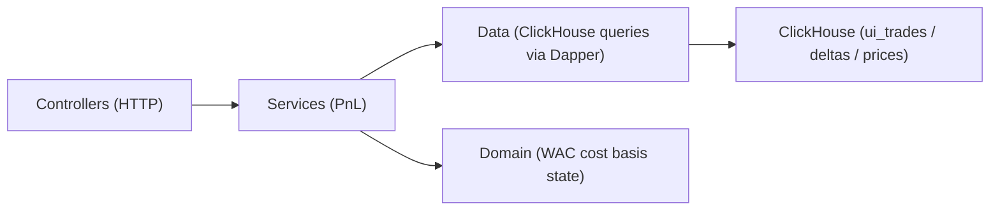

# Report — Crypto Wallet PnL Query Service

## Summary

This project implements a small, standalone HTTP API (C# / ASP.NET) that queries a ClickHouse dataset produced by a Solana indexer and returns per-token wallet PnL for a requested UTC time range.

Primary goal: provide a clean API surface and a query layer that can evolve without turning into one large controller method, while remaining safe (parameterized SQL) and reasonably efficient for time-bounded requests.

This is a **medium-hard task** mainly due to PnL semantics, not due to HTTP or ClickHouse connectivity. The API must avoid confusing:

```text
trade intent            ≠ token transfers
trade PnL               ≠ wallet balance delta
realized PnL            ≠ mark-to-market unrealized PnL
DeFi inflow/outflow     ≠ all movement into/out of wallet
```

## API

### Endpoints

- `GET /healthz/`
  - Unauthenticated liveness check.
- `GET /api/db/clickhouse`
  - ClickHouse connectivity health check (requires API key when `API_KEY` is configured).
- `GET /wallets/{address}/pnl?from=<utc>&to=<utc>`
  - Returns one row per token traded by the wallet in the requested range.

### Request parameters

`from` and `to` are required UTC timestamps (the service accepts):

- ISO-8601 / RFC3339 strings (recommended), e.g. `2026-05-25T02:30:00Z`
- Unix timestamps in seconds or milliseconds (numeric strings)

`costBasisScope`:

- `RangeOnly` (0): cost basis uses only trades in `[from, to)`. Fastest; may be inaccurate if the position existed before `from`.
- `Warmup` (1): attempts to include a limited warmup history (bounded window + row limit) before `from` to approximate full cost basis.

`includeTransfers`:

- Currently diagnostic-only; echoed in response meta for forward compatibility.

### Response shape

The response is JSON:

- `meta`: request echo + calculation notes
- `rows[]`: per-token metrics

Minimum required fields per token (included):

- `token`
- `realizedPnlUsd`
- `unrealizedPnlUsd`
- `netBalanceDelta`
- `closeHoldings`
- `totalBuyUsd` / `totalSellUsd`
- `latestPriceUsd`
- `tradeCount`

## Data model and query strategy (ClickHouse)

The service relies on three ClickHouse tables (in `solanav1`). The schema already provides a very useful abstraction: **`ui_trades`**. Without it, the service would need to reconstruct swap intent from lower-level raw swap records and transfers.

- `ui_trades`
  - Preferred for realized PnL/cost basis due to explicit `side` and chronological trade rows.
  - Important columns used here: `block_time`, `user_wallet`, `token`, `side`, `amount`, `volume_usd`, `tx_hash`, `compound_fees`.
- `wallet_1m_deltas`
  - Used for net balance delta and end-of-range holdings (physical changes, includes transfers).
  - Uses `argMaxMerge(close_holdings)` for close holdings.
- `token_prices_1m`
  - Used for mark price at or before `to` for unrealized PnL.

### How to think about the tables

- `ui_trades` is a **user-facing, per-token trade view**: one on-chain swap produces *two* token-centric rows (a `Buy` for the received token and a `Sell` for the spent token). This is perfect for per-token PnL, but means you should not interpret “sum of all volume_usd across tokens” as “total wallet swap volume” without considering double counting.
- `wallet_1m_deltas` is a **minute-level physical holdings table**. It captures all movement in/out of holdings (including non-trade transfers) via `delta_balance`. It is useful as a validation/diagnostic signal and as a source for end holdings.
- `token_prices_1m` provides the **mark price**. For unrealized PnL you must use the latest available price at or before `to`, not an average over the range.

### High-level flow

1. Find tokens traded by the wallet in `[from, to)` (`ui_trades`).
2. For those tokens:
   - Aggregate buys/sells and counts in `[from, to)` (`ui_trades`).
   - Fetch net balance delta and close holdings in `[from, to)` (`wallet_1m_deltas`).
   - Fetch latest price at or before `to` (`token_prices_1m`).
3. Fetch trade rows for cost basis:
   - `RangeOnly`: trade rows only in `[from, to)` (fast path).
   - `Warmup`: trade rows in a bounded warmup window ending at `to`, with a hard cap/limit.
4. Compute per-token Weighted Average Cost (WAC):
   - Buys add to inventory/cost basis.
   - Sells realize PnL vs current WAC.
5. Compute unrealized PnL:
   - `closeHoldings * latestPriceUsd - remainingCostBasisUsd`

### Example SQL (as implemented)

Token list for the wallet in range:

```sql
SELECT DISTINCT token
FROM solanav1.ui_trades
WHERE user_wallet = @wallet
  AND block_time >= @from
  AND block_time <  @to
```

Per-token aggregates in range (diagnostics):

```sql
SELECT
  token AS Token,
  count() AS TradeCount,
  sumIf(volume_usd, side = 'Buy')  AS TotalBuyUsd,
  sumIf(volume_usd, side = 'Sell') AS TotalSellUsd,
  sumIf(amount, side = 'Buy')      AS BuyAmount,
  sumIf(amount, side = 'Sell')     AS SellAmount,
  sum(volume_usd * compound_fees)  AS EstimatedCompoundFeesUsd
FROM solanav1.ui_trades
WHERE user_wallet = @wallet
  AND block_time >= @from
  AND block_time <  @to
GROUP BY token
```

Wallet deltas and end holdings:

```sql
SELECT
  token AS Token,
  sum(delta_balance) AS NetBalanceDelta,
  argMaxMerge(close_holdings) AS CloseHoldings
FROM solanav1.wallet_1m_deltas
WHERE user_wallet = @wallet
  AND minute >= toDateTime(@from)
  AND minute <  toDateTime(@to)
GROUP BY token
```

Latest price at or before `to`:

```sql
SELECT
  token AS Token,
  argMax(price, minute) AS LatestPriceUsd
FROM
(
  SELECT
    mint AS token,
    minute,
    argMaxMerge(close) AS price
  FROM solanav1.token_prices_1m
  WHERE mint IN @tokens
    AND minute <= toDateTime(@to)
  GROUP BY token, minute
)
GROUP BY token
```

### Why WAC (Weighted Average Cost)

WAC is a pragmatic default for this dataset:

- Works with a sequential trade stream.
- Stable and simple to explain.
- Does not require identifying specific lots (FIFO/LIFO) which would add complexity and potentially more query volume.

## Code structure

The code is split along HTTP vs query vs domain logic lines:



### HTTP layer

- `Controllers/PnlController.cs`
  - Request validation (range size, address length, timestamp parsing).
- `Controllers/DbController.cs`
  - ClickHouse health endpoint.
- `Controllers/HealthController.cs`
  - Liveness endpoint.

### Service layer

- `Services/Pnl/PnlService.cs`
  - Orchestrates repository calls and performs in-memory WAC calculations.
- `Services/Pnl/UtcTimestampParser.cs`
  - Parses ISO-8601 and Unix timestamps into UTC `DateTimeOffset`.

### Query layer

- `Data/Pnl/PnlQueryRepository.cs`
  - Parameterized SQL via Dapper + `ClickHouse.Driver`.
  - Defensive caps:
    - Warmup window is bounded by `CLICKHOUSE_WARMUP_MAX_DAYS`.
    - Trade paging and hard limits protect against huge responses.

### Domain logic

- `Domain/Pnl/WeightedAverageCostState.cs`
  - Minimal state machine for WAC inventory/cost basis and realized PnL.

## Safety and operational notes

### Parameterized SQL

All ClickHouse queries use Dapper parameters (no unescaped user string interpolation).

### Defensive limits

ClickHouse is treated as the bottleneck:

- API enforces a maximum time range of 30 days.
- Warmup has a bounded lookback window and a hard row limit.
- Query timeouts are configurable via env vars.

### Auth model

Cloud Run is publicly invokable; application-level auth is enforced via `X-API-Key` header when `API_KEY` is configured.

### Telemetry

The service always returns:

- `X-Trace-Id` response header

and logs only failures (5xx / exceptions) by default to reduce noise, while preserving debuggability in Cloud Run logs.

### Health check path note (Cloud Run)

In practice, Google Frontend / Cloud Run can behave inconsistently for `/healthz` vs `/healthz/`. To keep Swagger “Try it out” reliable and keep probes simple:

- The controller route is exposed as `/healthz/`.
- The middleware normalizes `/healthz` → `/healthz/`.

## Scalability considerations

This solution is designed for time-bounded interactive queries:

- `RangeOnly` is fast and scales well for dashboards where the user selects a short range.
- `Warmup` can become expensive for highly active wallets; the bounded warmup window + limits prevent runaway scans.

If this needs to scale to many concurrent queries for very active wallets:

- Consider pre-aggregating per-wallet/token cost basis state in a materialized view (e.g., per-hour or per-day snapshots).
- Consider caching token prices and/or per-wallet token lists for hot wallets.
- Consider moving to an async job model for long warmup queries.

## CI/CD

GitHub Actions performs:

- build/test
- Docker build and push to Docker Hub (`crypto:<sha>`, `crypto:latest`)
- deploy to Google Cloud Run

Current Cloud Run URL:

- https://crypto-92654428298.europe-west1.run.app

Docker Hub repository:

- https://hub.docker.com/repository/docker/dysoncucumber/crypto/general
